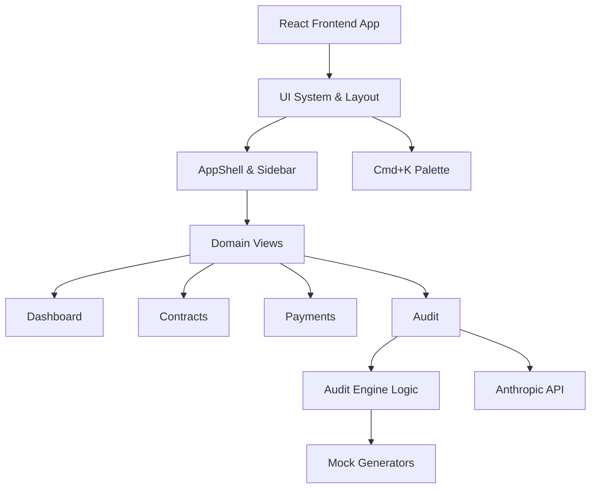

# Digital License Royalty Auditor (DLRA.SYS)

A high-performance command-center application designed to detect, analyze, and recover royalty payment leakages for digital content distributors resulting from misapplied contract terms, expired tier-caps, and territorial discrepancies.


## 🏆 Internship Demo Script

Welcome to the **Digital License Royalty Auditor** final demo walkthrough. 

### Act I: The Problem (Contracts.jsx & PaymentsPage.jsx)
1. **Navigate to the Contracts Registry.** Show that we have a massive table of complex license agreements across multiple territories and asset tiers. Note how unmanageable this is to audit manually.
2. **Navigate to the Payments Ledger.** Highlight that millions of payment events stream in daily. Show the clean Data Table interface and explain the issue: "How do we know if these millions of transactions align with the 1,000+ complex contracts?"

### Act II: The Engine (AuditPage.tsx & Trace)
1. **Open the Global Command Palette (`Cmd+K`).** Run the command: `Run AI Audit Engine`.
2. **The Audit Execution.** The user is taken to the Audit view. Click `Run Audit`. Observe the real-time streamed logs simulating the AI Pipeline (ContractReader, LogAggregator, Calculator, LeakageDetector).
3. **The Reveal.** The screen presents the total discrepancy detected—a massive multi-thousand-dollar recovery opportunity categorized into Underpayments, Overpayments, and missing line items.

### Act III: Natural Language AI & Global Utilities
1. **NL Query module.** At the bottom of the Audit Page, use the "Ask Audit Data" tool. Type in: *"Which studio represents the highest risk?"*. Watch the Anthropic Claude-3 model analyze the results and provide strategic advice on the dataset.
2. **The Export.** Bring up the `Cmd+K` palette again. Run `Export Data to CSV`. Show how seamlessly the platform allows auditors to pull physical reports for client recovery negotiations.
3. **App aesthetics.** Point out the carefully crafted "VS Code meets Bloomberg Terminal" design DNA. Highlight responsive data tables, `framer-motion` page transitions, and the `react-hot-toast` notifications.

---

## 🏗️ Architecture

The frontend leverages a React-Vite stack wrapped in an isolated, dark-terminal `AppShell`. 

**Core Technologies:**
- **Framework:** React 18 + Vite
- **Routing:** React Router v6 (using `<AnimatePresence>` for fluid module switching)
- **Styling:** CSS variables & inline styles mapped to a strict Design DNA system
- **Animations:** `framer-motion`
- **Notifications:** `react-hot-toast`
- **AI Integration:** Anthropic API (Claude 3 Haiku) connected via direct fetch in `AuditPage.tsx`



## 🚀 Getting Started

1. Clone repository and install dependencies in `frontend/`:
   ```bash
   npm install
   ```
2. Create `frontend/.env.local`:
   ```bash
   VITE_ANTHROPIC_API_KEY=your_anthropic_api_key_here
   ```
3. Run the development server:
   ```bash
   npm run dev
   ```

## 🎨 Design DNA
* **Typography:** Syne (Hero/Display), JetBrains Mono (Financials/Data), DM Sans (Body)
* **Colors:** Void Base (`#080B0F`), Neon Teal (`#00D9C0`), Alert Amber (`#F5A623`)
* **Layouts:** Minimal padding overhead, maximum data density, sharp rounded corners, subtle glows on interactions.

---
*Built for the 2026 Fall Engineering Cohort presentations.*
